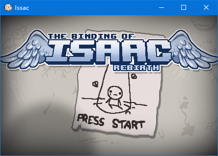
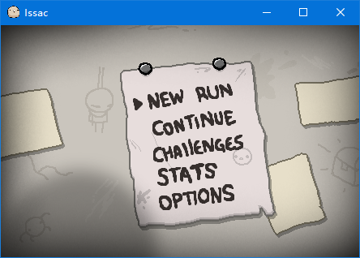
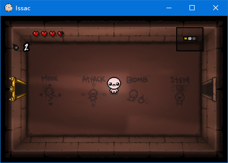
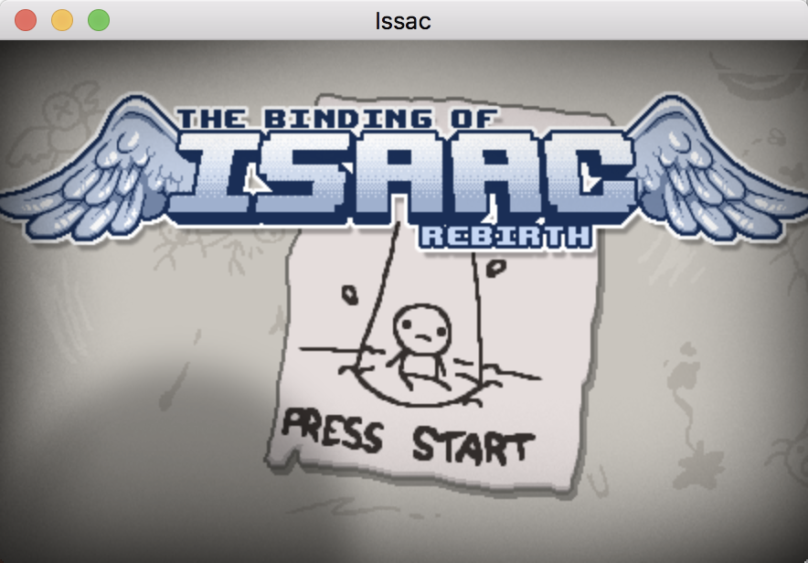
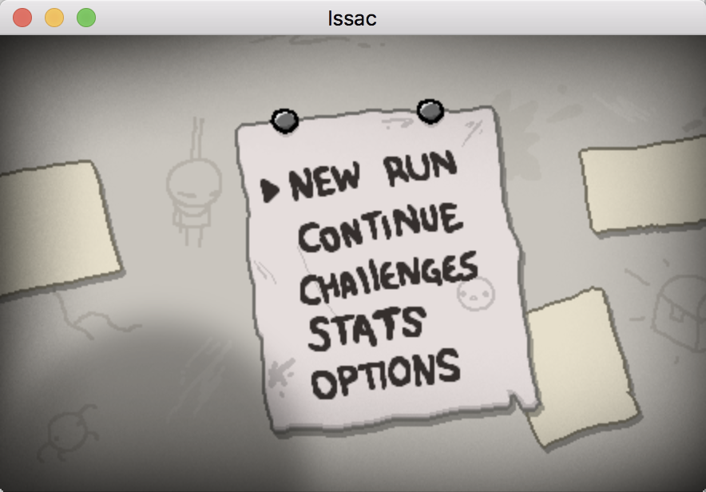
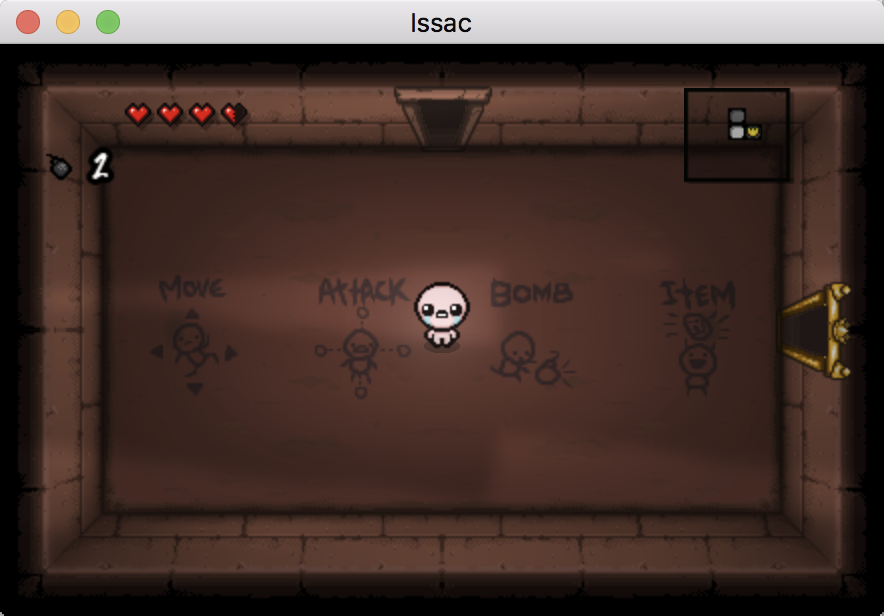

# WheelCreator 小组作品

## Issac 游戏

复旦大学微电子科学与工程系

- 施葹 15307130017
- 蔡俊哲 15307130076
- 王渝 15307130258

### 开发环境

cocos2dx 3.16

- Window 10 1803
  - Visual Studio 2017
- macOS Sierra 10.12
  - Xcode 9.2

### 主要实现功能

- 多个房间切换
- 单层 Level 完整
- 多种怪物
- 眼泪打击动画，怪物死亡动画
- Boss 逻辑，完整闭环
- Debug 模式地图和迷宫地图
- Issac 死亡动画
- 地面物品系统
- 炸弹

### 游戏截图

- Windows

- macOS

